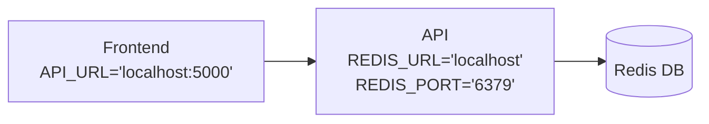

# TD n°3 - Conteneurisation

Les notions abordées durant ce TD seront liées à `docker`, à `docker-compose` et à la sécurité des conteneurs.

## Simple application

Nous allons construire une simple application frontend / backend et les conteneuriser.

### Backend

Commençons par un coeur de d'application, en utilisant [Flask](https://flask.palletsprojects.com/en/stable/quickstart/), qui va dans un premier temps réponde `Hello, World!` lors d'un appel sur la route `/`.

#### Prérequis

Si ce n'est pas déjà fait: 
1. Installer python3 et pip3
   ```shell
    sudo apt install python3
    sudo apt install python3-pip
   ```
2. Installer [Flask](https://flask.palletsprojects.com/en/stable/quickstart/), Flask est un framework web léger écrit en Python. Il permet de créer rapidement des applications web ou des API REST, un peu comme Express.js pour Node.js.

   ```shell
   pip3 install flask
   ```
3. Créer dans votre dépôt un dossier `backend` et un dossier `frontend`.


#### Implementation

Dans le dossier `backend`, créer un fichier `server.py` contenant l'implementation d'un serveur Flask (documentation: [Flask](https://flask.palletsprojects.com/en/stable/quickstart/)).

Vous devriez pouvoir exécuter le serveur avec la commande: `flask run`

Accéder à votre serveur via votre navigateur à l'addresse http://localhost:5000. Vous venez de créer votre premier serveur 🚀

> [!tip]
> Si vous utilisez CodeSpace, suivez le lien qui s'affiche dans la pop-up en bas à droite.

### Frontend


## docker-compose

Nous allons utiliser `docker-compose` pour unifié le déploiement d'une ensemble de conteneur sur votre machine.

Nous reprendrons les images exécutées dans le projet de l'exercice précédent pour déployer localement et en une commande l'architecture suivante :



### Mise en place

Voici un template de fichier `compose.yaml` utilisé par la commande `docker compose up` :

```yaml
services:
  frontend:
    image: <image>
    ports:
      - "<port-hote>:<port-ctn>"
    environment:
      - <key>=<value>
    networks:
      - myapp-network

  backend:
    <to-do-for-backend>
  <other-services>
networks:
  # La présence de la ligne suivante suffit pour demander la création du réseau.
  myapp-network: {}
```

À partir du template ci-dessus et [de la documentation](https://docs.docker.com/compose/intro/compose-application-model/) :

1. Dans un dossier `td-conteneurisation`, créer un fichier `compose.yaml`.
2. Le parametre `image` correspond aux images suivi du tag (`image:tag`) que vous avez construit dans l'exercice précédent.
3. Définissez, pour chaque conteneur de l'architecture, un service dans le tableau `services`.
4. Validez le l'architecture en la démarrant localement avec la commande:

   ```shell
   docker compose up
   ```
   > Vous pouvez arrêter les différents conteneurs en une commande : `docker compose down`
5. Rendez-vous sur http://localhost:8080 👈

> [!note]
> Le réseau virtuel `myapp-network`, dans lequel vont s'incrire ces conteneurs, n'a pas besoin paramètre supplémentaire.

### Du build au déploiement

`docker-compose` permet également d'unifié le dévelopement des différents tiers de l'application.

1. Dans le dossier `td-conteneurisation`, créer un dossier `frontend` et `backend`.
2. Ajouter les codes et les Dockerfile du `frontend` et de l'API du projet Virtualization Cloud Computing dans ces dossiers.
3. Pour chacun des services définis dans le fichier `compose.yaml`, ajouter l'argument `build` qui permet de definir où se trouvent les fichiers sources des différents services de la composition.

    ```yaml
        # ...
        frontend:
          build:
            context: ./frontend/                      # Dossier d'exécution du `docker build`
            dockerfile: frontend/Dockerfile           # Dockerfile à utiliser pour l'exécution du `docker build`
        # ...
    ```

4. Contruiser tous les conteneurs en une seule fois en utilisant la commande :

    ```shell
        docker compose build
    ```

## Sécurité des conteneurs

### Trivy

[Trivy](https://github.com/aquasecurity/trivy) est un outil de scan d'image qui permet d'identifier les vulnérabilités d'une configuration.

En vous basant sur [la documentation de l'outil](https://trivy.dev/v0.57/getting-started/installation/), installer l'outil en suivant les étapes recommandées pour votre système.

Trivy s'utilise sur des configurations (Kubernetes, Terraform, etc) et des images en suivant le format de commande suivant:

```bash
trivy <target> [--scanners <scanner1,scanner2>] <subject>
```

Nous allons scanner notre première image, utiliser `trivy` pour scanner l'image `python:3.4-alpine`.

```bash
trivy image python:3.4-alpine
```

**Que pouvez-vous observer ?**

Nous allons maintenant scanner les images construites dans la parties précédentes.

1. Construiser les images de conteneur `frontend` et `backend` à partir de leur Dockerfile et scanner ces images.
2. Résolver les vulnérabilités identifiées par `trivy`.
3. Reconstruiser et rescanner vos images, si des vulnérabilités sont listées, reprennez **à l'étape 2**.

**Un dernier test pour la route**

Scanner l'ensemble des fichiers du dossier de votre dépôt en local avec `trivy`.

> [!tip]
> Un ensemble de fichiers et de dossiers avec une racine commune est aussi appelé "système de fichier" qui se traduit par "File System" en anglais et s'abrège `fs`.

#### Bonus - Tout ça en plus simple

Trivy dispose d'une GitHub Action ! Via les informations de [ce dépôt](https://github.com/aquasecurity/trivy-action) et le Market Place des GitHub Action. Mettez en place sur votre dépôt une GitHub Action qui scan les images issues de vos Dockerfiles.
