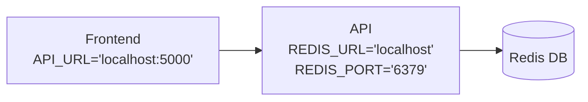

# TD n°3 - Conteneurisation ++

Les notions abordées durant ce TD seront liées à `docker-compose` et à la sécurité des conteneurs.

## docker-compose

Nous allons utiliser `docker-compose` pour unifié le déploiement d'une ensemble de conteneur sur votre machine.

Nous reprendrons les images exécutées dans le projet de Virtualisation et Cloud Computing pour déployer localement et en une commande l'architecture suivante :


Rappel: 
- L'image du frontend devrait ressembler à ça: `europe-west1-docker.pkg.dev/polytech-dijon/polytech-dijon/frontend-2024:nom1-nom2` (le conteneur exposera le port `8080`).
- l'image de l'API devrait ressembler à ça: `europe-west1-docker.pkg.dev/polytech-dijon/polytech-dijon/backend-2024:nom1-nom2` (le conteneur exposera le port `5000`).
- Pour **Redis** utiliser: `redis` (le conteneur exposera le port `6379`).

> [!important]
> **Impossible de télécharger les images ?** Réauthentifiez vous avec la commande `gcloud auth login` et `gcloud auth configure-docker europe-west1-docker.pkg.dev`.
>
> **Toujours rien ?** Faites moi signe 👋

### Mise en place

Voici un template de fichier `compose.yaml` utilisé par la commande `docker compose up` :

```yaml
services:
  frontend:
    image: <image>
    ports:
      - "<port-hote>:<port-ctn>"
    environment:
      - <key>=<value>
    network:
      - myapp-network

  backend:
    <to-do-for-backend>
  <other-services>
networks:
  # La présence de la ligne suivante suffit pour demander la création du réseau.
  myapp-network: {}
```

À partir du template ci-dessus et [de la documentation](https://docs.docker.com/compose/intro/compose-application-model/) :

1. Dans un dossier `td-conteneurisation`, créer un fichier `compose.yaml`.
2. Définissez, pour chaque conteneur de l'architecture, un service dans le tableau `services`.
3. Validez le l'architecture en la démarrant localement avec la commande:

   ```shell
   docker compose up
   ```
   > Vous pouvez arrêter les différents conteneurs en une commande : `docker compose down`
4. Rendez-vous sur http://localhost:8080 👈

> [!note]
> Le réseau virtuel `myapp-network`, dans lequel vont s'incrire ces conteneurs, n'a pas besoin paramètre supplémentaire.

### Du build au déploiement

`docker-compose` permet également d'unifié le dévelopement des différents tiers de l'application.

1. Dans le dossier `td-conteneurisation`, créer un dossier `frontend` et `backend`.
2. Ajouter les codes et les Dockerfile du `frontend` et de l'API du projet Virtualization Cloud Computing dans ces dossiers.
3. Pour chacun des services définis dans le fichier `compose.yaml`, ajouter l'argument `build` qui permet de definir où se trouvent les fichiers sources des différents services de la composition.

    ```yaml
        # ...
        frontend:
          build:
            context: ./frontend/                      # Dossier d'exécution du `docker build`
            dockerfile: frontend/Dockerfile           # Dockerfile à utiliser pour l'exécution du `docker build`
        # ...
    ```

4. Contruiser tous les conteneurs en une seule fois en utilisant la commande :

    ```shell
        docker compose build
    ```

## Sécurité des conteneurs

### Trivy

[Trivy](https://github.com/aquasecurity/trivy) est un outil de scan d'image qui permet d'identifier les vulnérabilités d'une configuration.

En vous basant sur [la documentation de l'outil](https://trivy.dev/v0.57/getting-started/installation/), installer l'outil en suivant les étapes recommandées pour votre système.

Trivy s'utilise sur des configurations (Kubernetes, Terraform, etc) et des images en suivant le format de commande suivant:

```bash
trivy <target> [--scanners <scanner1,scanner2>] <subject>
```

Nous allons scanner notre première image, utiliser `trivy` pour scanner l'image `python:3.4-alpine`.

```bash
trivy image python:3.4-alpine
```

**Que pouvez-vous observer ?**

Nous allons maintenant scanner les images construites dans la parties précédentes.

1. Construiser les images de conteneur `frontend` et `backend` à partir de leur Dockerfile et scanner ces images.
2. Résolver les vulnérabilités identifiées par `trivy`.
3. Reconstruiser et rescanner vos images, si des vulnérabilités sont listées, reprennez **à l'étape 2**.

**Un dernier test pour la route**

Scanner l'ensemble des fichiers du dossier de votre dépôt en local avec `trivy`.

> [!tip]
> Un ensemble de fichiers et de dossiers avec une racine commune est aussi appelé "système de fichier" qui se traduit par "File System" en anglais et s'abrège `fs`.

#### Bonus - Tout ça en plus simple

Trivy dispose d'une GitHub Action ! Via les informations de [ce dépôt](https://github.com/aquasecurity/trivy-action) et le Market Place des GitHub Action. Mettez en place sur votre dépôt une GitHub Action qui scan les images issues de vos Dockerfiles.

### Falco

[Falco](https://falco.org/) est un outil de sécurité Cloud Natif qui assure la sécurité à l'exécution des machines hôtes, des conteneurs, de Kubernetes, des environnements Cloud. C'est un outil actif qui surveille l'environnement dans lequel il est déployé en temps réel.

Pour ce faire, Falco utilise le concept de **règle**. Chaque règle décrit un comportement à risque et le niveau de criticité associé à ce comportement. Si un de ces comportements est observé, Falco l'enregistre sous la forme d'évenement.

Falco a été installé au sein du cluster Kubernetes que nous avons utilisé durant le module de **Virtualisation & Cloud Computing**.

Nous allons commencer par tester la configuration par défaut de Falco.

1. Connectez-vous au cluster.
2. Créer un déploiement pour une Pod exécutant l'image `nginx`.

    ```shell
    kubectl create deployment nginx --image=nginx
    ```

3. Executons maintenant dans ce pod, un comportement suspect:

    ```shell
    kubectl exec -it $(kubectl get pods --selector=app=nginx -o name) -- cat /etc/shadow
    ```

    > [!info]
    > Cette commande tente d'afficher le contenu du fichier `shadow` stocker dans le dossier `/etc/` du conteneur exécuté (dossier administrateur).

4. Que pouvez-vous observé dans les logs de Falco ? (affichage des evenements de type `Warning`)

    ```shell
    kubectl logs -l app.kubernetes.io/name=falco -n falco -c falco | grep Warning
    ```

> [!tip]
> **Félicitation !** Vous avez pu observer votre premier évènement de sécurité avec [Falco](https://falco.org/).
>
> Curieux de savoir quelle était cette règle qui a été enfreinte ? Sa description est [ici](https://github.com/falcosecurity/rules/blob/c0a9bf17d5451340ab8a497efae1b8a8bd95adcb/rules/falco_rules.yaml#L398).


Vous allez maintenant créer votre propre règle et l'ajouter au catalogue de surveillance de Falco.

1. Créer un fichier `my-falco-rule.yaml` à partir du contenu suivant :

```yaml
customRules:
  custom-rules.yaml: |-
    - rule: Prevent exams
      desc: An attempt to create a exam.pdf file.
      condition: >
        (evt.type in (open,openat,openat2) and evt.is_open_write=true and fd.typechar='f' and fd.num>=0)
        and fd.name contains exam.pdf
      output: "File that look like an exam opened for writing (file=%fd.name pcmdline=%proc.pcmdline gparent=%proc.aname[2] ggparent=%proc.aname[3] gggparent=%proc.aname[4] evt_type=%evt.type user=%user.name user_uid=%user.uid user_loginuid=%user.loginuid process=%proc.name proc_exepath=%proc.exepath parent=%proc.pname command=%proc.cmdline terminal=%proc.tty %container.info)"
      priority: WARNING
      tags: [filesystem, mitre_persistence]    
```

2. Charger la règle dans l'instance de Falco en exécution dans le cluster.

    ```shell
    helm upgrade --namespace falco falco falcosecurity/falco --set tty=true -f falco_custom_rules_cm.yaml
    ```

    > [!note]
    > `helm` est un outil pour faciliter la manipulation de manifest `yaml`. [Installer HELM](https://helm.sh/fr/docs/intro/install/)

3. Attendez que l'instance de Falco est redémarré avec la nouvelle règle.

    ```shell
    kubectl wait pods --for=condition=Ready --all -n falco
    ```

4. Tester votre règle.

    ```shell
    kubectl exec -it $(kubectl get ns -o name) -- touch /etc/exam.pdf
    ```

    ```shell
    kubectl logs -l app.kubernetes.io/name=falco -n falco -c falco | grep Warning
    ```

> [!tip]
> **Vous avez créer votre première règle Falco 🚀**

## Bonus - Accéder à l'interface pour lire les évènements

Falco possède un projet annexe nommé **Falcosidekick**, offrant une interface utilisateur pour la lecture des évènements. **Falcosidekick** et **Falcosidekick UI** ont été ajouté au cluster.

1. Utiliser le `port-forward` pour créer un tunnel entre votre machine et le service **Falcosidekick UI**.

```shell
kubectl get -n falco service
```
```shell
kubectl -n falco port-forward svc/falco-falcosidekick-ui 2802
```

2. Accéder à l'interface via votre navigateur préféré en vous rendant sur http://localhost:2802/
